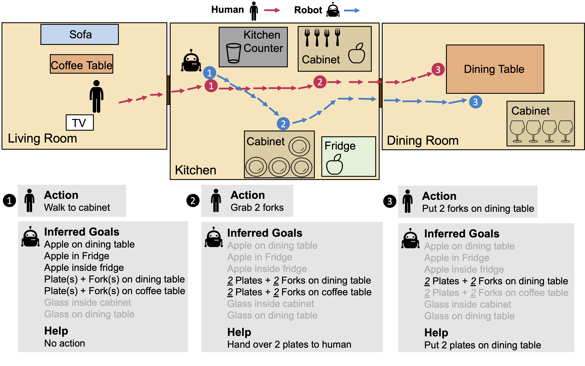

# NOPA: Neurally-guided Online Probabilistic Assistance for Building Socially Intelligent Home Assistants

This is the official implementation of the paper [*NOPA: Neurally-guided Online Probabilistic Assistance for Building Socially Intelligent Home Assistants*](https://arxiv.org/abs/2010.09890). 


In this work, we study how to build socially intelligent robots to assist people in their homes. In particular, we focus on assistance with online goal inference, where robots must simultaneously infer humans' goals and how to help them achieve those goals. For that, we propose **NOPA** (Neurally-guided Online Probabilistic Assistance), a method that predicts a set of goals given some observed human behavior and assist the human by taking actions based on the uncertainty of the inferred goal. 

To test this framework, we compare our method against multiple baselines in a new embodied AI assistance challenge: Online Watch-And-Help, in which a helper agent needs to simultaneously watch a main agent's action, infer its goal, and help perform a common household task faster in realistic virtual home environments.
 
 


We provide a dataset of tasks to evaluate the challenge, as well as different baselines consisting on learning and planning-based agents.

Check out a video of the work [here](https://youtu.be/lrB4K2i8xPI).

## Cite
If you use this code in your research, please consider citing.

```
@misc{puig2020watchandhelp,
      title={Watch-And-Help: A Challenge for Social Perception and Human-AI Collaboration}, 
      author={Xavier Puig and Tianmin Shu and Shuang Li and Zilin Wang and Joshua B. Tenenbaum and Sanja Fidler and Antonio Torralba},
      year={2020},
      eprint={2010.09890},
      archivePrefix={arXiv},
      primaryClass={cs.AI}
}
```

## Setup
### Get the VirtualHome Simulator and API
Clone the [VirtualHome API](https://github.com/xavierpuigf/virtualhome.git) repository one folder above this repository

```bash
cd ..
git clone https://github.com/xavierpuigf/virtualhome.git
cd virtualhome
pip install -r requirements.txt
```

Download the simulator, and put it in an `executable` folder, one folder above this repository


- [Download](http://virtual-home.org/release/simulator/v2.0/linux_exec.zip) Linux x86-64 version.
- [Download](http://virtual-home.org/release/simulator/v2.0/macos_exec.zip) Mac OS X version.
- [Download](http://virtual-home.org/release/simulator/windows_exec.zip) Windows version.

### Install Requirements
```bash
pip install -r requirements.txt
```


## Dataset
Dataset coming soon


## Test the NOPA model
Coming soon

## Visualize results
Coming soon